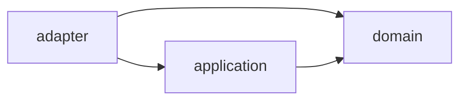

# ADR 0021: Layer feature packages inside each core feature

- Date: 2026-08-28
- Related principles/ADRs: [Principles 12, 14, 15, and 18](../design-principles.md), [ADR 0002](0002-isolate-matcha-behind-adapter.md), [ADR 0011](0011-travelers-cache.md), [ADR 0020](0020-private-project-license-separation.md)

## Status

Accepted. This is the package structure for implemented `dev.forever.core.<feature>` systems.

## Context

Forever is organised by feature on the outside. That keeps storage, mastery, settlement,
equipment, and the other systems understandable as separate verticals. The feature
packages had nevertheless become flat directories. A flat package places pure validation,
persistent records, use-case orchestration, item registration, world access, and codecs beside
each other without showing which direction a dependency is meant to travel.

The problem is structural rather than purely aesthetic. The storage feature already contains
substantial logic that can be exercised without a running game, alongside code that must run
against `ItemStack`, `ServerLevel`, registries, resource reloads, and `SavedData`. Without a
visible boundary, a later change can put a Minecraft call into a value type or make a server
adapter depend on a higher-level implementation by accident. That weakens the server authority
boundary, makes plain JVM tests less useful, and makes save and compatibility reviews harder.

The design also needs to remain practical for an AI-maintained Java codebase. A large module
split or a framework-heavy implementation would add indirection before the project has a
second implementation of most contracts. The first migration therefore needs to be a small,
reviewable pilot that preserves behaviour, registry identifiers, persistent shapes, and public
operation semantics.

## Decision

Each implemented feature remains under `dev.forever.core.<feature>`, and may contain the
following inner packages when there is real code for them:

- `domain` contains pure feature rules, value objects, validation, and result types. Domain
  source must not import `net.minecraft`, Fabric APIs, a feature adapter, or an application
  package. A codec for a value that is still independent of Minecraft may remain with that
  domain value. A codec that binds to Minecraft registries, `ItemStack`, or a save API belongs
  in `adapter`.
- `application` contains feature use cases and orchestration that is independent of concrete
  Minecraft integration. It may depend on `domain` and neutral shared code, but it must not
  depend on `adapter`. A port is justified when there is a real second implementation or a
  test seam that materially improves behaviour coverage. Empty interfaces and speculative
  ports are not required by this decision.
- `adapter` contains Minecraft and Fabric integration, including items, components, registries,
  `SavedData`, resource reload listeners, world and container access, Minecraft-shaped
  persistence codecs, and server event entrypoints. It may depend on `application` and
  `domain`.

The allowed dependency direction is therefore inward only:

Same-layer dependencies are allowed when they do not create a cycle. The client source set
remains outside this feature structure and is a projection of server state. Core code must
not depend on `dev.forever.client`. Concrete classes from another feature must not be used as
an informal shared API. Cross-feature contracts belong in an approved API or shared boundary,
not in a reverse layer dependency.

Classification is based on what a class does and the types it owns, not on its filename. A
class with no direct Minecraft import is only a domain candidate. Its transitive types and
responsibility must also be inspected. Conversely, a registration entrypoint or an adapter
codec may be placed in `adapter` even when its own imports happen not to mention Minecraft.

The pilot applies this structure to exactly `core/storage`. It moves files with `git mv`,
updates the affected source and test packages, and does not migrate any other feature. The
move is structural only. It must not change registry IDs, resource paths, schema versions,
codec fields, validation rules, transfer atomicity, or server authority.

### Pilot classification

The following table records the inspection result for every storage source file.

| File | Layer | Classification basis |
|---|---|---|
| `CacheOperation.java` | `domain` | Pure bounded operation result and explanation key. |
| `CacheValidation.java` | `domain` | Pure validation result with no game integration. |
| `ContainerItemPredicate.java` | `adapter` | Inspects `ItemStack` components, item capabilities, and registries. |
| `ContainerReference.java` | `adapter` | Owns `ResourceKey<Level>` and `BlockPos` for a physical inventory address. |
| `ContainerSnapshot.java` | `adapter` | Copies physical `ItemStack` slots at the Minecraft boundary. |
| `ForeverStorage.java` | `adapter` | Registers storage components, items, reload listeners, and `SavedData`. |
| `IndexMutationResult.java` | `domain` | Pure bounded index mutation result. |
| `InventoryIndex.java` | `adapter` | Builds entries from `ItemStack` and registry identities and decorates Minecraft-shaped results. |
| `InventoryIndexEntry.java` | `adapter` | Persists `Identifier` and `ContainerReference` values from Minecraft. |
| `InventoryIndexState.java` | `adapter` | Persists and validates state containing adapter-owned entries and references. |
| `PhysicalInventoryTransfer.java` | `adapter` | Mutates Minecraft `Container` and `ItemStack` slots atomically. |
| `PhysicalTransferResult.java` | `domain` | Pure bounded transfer result. |
| `StorageBalance.java` | `domain` | Validated balance values and schema rules are independent of Minecraft. |
| `StorageBalanceAccess.java` | `application` | Publishes the current immutable balance snapshot used by storage operations. |
| `StorageBalanceLoader.java` | `adapter` | Reads server data resources and installs the balance through Fabric reload APIs. |
| `StorageCodecs.java` | `adapter` | UUID codec helper used by Minecraft-shaped persisted warehouse records. |
| `StorageContainerAccess.java` | `adapter` | Performs non-loading `ServerLevel` and block-container access. |
| `StorageSafetyLimits.java` | `domain` | Pure absolute safety bounds shared by domain validation and adapter persistence checks. |
| `TravelerCache.java` | `adapter` | Performs server-side `ItemStack`, component, and physical container mutations. |
| `TravelerCacheComponent.java` | `adapter` | Registers a persistent and network-synchronised Minecraft data component. |
| `TravelerCacheContents.java` | `adapter` | Owns `ItemStack` contents, component persistence, and nesting checks. |
| `TravelerCacheItem.java` | `adapter` | Registers and constructs the Minecraft cache item. |
| `WarehouseController.java` | `adapter` | Coordinates `ServerLevel`, `SavedData`, loaded containers, and index reconciliation. |
| `WarehouseMutationResult.java` | `adapter` | Carries an adapter-owned `WarehouseRecord` in its optional result. |
| `WarehouseRecord.java` | `adapter` | Owns dimension keys, block positions, container references, and their codec. |
| `WarehouseSavedData.java` | `adapter` | Bridges dimension-scoped warehouse state to Minecraft `SavedData`. |
| `WarehouseSearchPage.java` | `adapter` | Serialises a response containing adapter-owned search results. |
| `WarehouseSearchRequest.java` | `domain` | Bounded query validation and protocol value with no Minecraft type. |
| `WarehouseSearchResult.java` | `adapter` | Exposes Minecraft `Identifier` and physical container location. |
| `WarehouseState.java` | `adapter` | Persists a map of adapter-owned warehouse records. |

## Known exceptions

### EquipmentMath remains at its feature root

`EquipmentMath` sits at `dev.forever.core.equipment` rather than in `domain`, and is the only
class in any feature that is not inside a layer package. Its API consumes `EquipmentBalance`
and `EquipmentState`, which are Minecraft-shaped records living in `adapter`. Placing it in
`domain` would therefore invert the dependency and make domain code depend on the adapter,
which is precisely what this ADR forbids. Introducing neutral replacement value types would be
a redesign rather than a structural move.

The rationale is repeated on the class itself, so a reader encountering it does not have to
find this ADR to know the placement is deliberate. If a future ticket gives the feature
neutral value types, the class should move into `domain` and this exception should be removed.

### WarehouseController remains one adapter class

`WarehouseController` is approximately 430 lines and combines transaction synchronisation,
non-loading world access, physical-container reconciliation, and index updates. It is an
honest adapter because every public operation requires `ServerLevel` and its state is obtained
from `WarehouseSavedData`. Splitting it into an application service without first defining
stable, tested ports would either make the application depend on adapter classes or duplicate
transaction rules. Both choices would be more invasive than this structural pilot and could
change atomicity. A later behaviour ticket may introduce a seam if a second implementation or
substantive test need appears. This ADR does not require that speculative split.

### The pilot application layer is intentionally small

`StorageBalanceAccess` is the only storage class placed in `application`. The existing storage
implementation has no Minecraft-independent use-case service. Creating wrappers solely to
populate the directory would violate the no-placeholder rule and add no boundary. The absence
of a larger application layer is therefore recorded rather than concealed.

### Pure-domain codecs remain with pure values

`StorageBalance` and `WarehouseSearchRequest` retain their Mojang serialization codecs in
`domain` because their encoded values do not contain Minecraft types and moving those codecs
would create extra classes without improving the dependency direction. Minecraft-shaped codecs
remain in `adapter`, including the codecs for `ContainerReference`, `TravelerCacheContents`,
and warehouse records.

### Safety limits are a small public domain boundary

`StorageSafetyLimits` was package-private in the flat package. Adapter records use the same
absolute guards when validating persisted data, so the constants are public within the feature's
domain package after the move. This is a read-only safety contract, not an adapter dependency
on application code or mutable world state. Other features must not use these storage-specific
limits as their own balance policy.

## Consequences

- The package path now communicates whether a storage class is a pure rule, a lifecycle
  service, or a Minecraft boundary. A reviewer can find the likely change location before
  reading every file.
- Domain result types and balance/query validation remain suitable for plain JVM tests. They
  cannot acquire a Minecraft dependency without violating an explicit package rule.
- Minecraft registration, world access, ItemStack mutation, and save integration are visibly
  concentrated in `adapter`, which makes dedicated-server and authority reviews more direct.
- The pilot keeps feature locality. Storage does not become a project-wide layer, and the
  remaining feature packages are intentionally unchanged until their own migrations are
  reviewed.
- Existing callers must use the new package names. This is an internal source-structure
  change, not a promise that the old flat package is a stable external API.
- Import lists and some fully qualified references become longer. That cost is accepted in
  exchange for making layer crossings explicit.
- The application layer is sparse in the pilot. It is better to show that accurately than to
  introduce a general-purpose service or port with no independent implementation.
- The move does not change serialized field names, schema versions, registry identifiers,
  resource paths, or the ownership of physical ItemStacks. Package names are not part of the
  existing storage data formats.
- No world migration is required for this structural change, but the normal save-safety checks
  still apply to later changes in these packages. A future schema change remains a separate
  migration decision under Principle 18.
- A future feature migration must repeat the same inspection, package classification, call-site
  update, and dedicated-server verification. It must not assume that storage's classification
  table applies mechanically to another feature.

## Rejected alternatives

### One project-wide `domain`, `application`, and `adapter` tree

A project-wide layer tree would make the layer names visible, but it would scatter one feature
across distant directories and encourage shared implementation dependencies. Feature locality
is valuable for review and for AI maintenance. The accepted structure keeps the outer package
by feature and adds only a light inner layering.

### Move every storage class into `domain`

This would minimise imports, but it would place `ItemStack`, `ServerLevel`, registries,
`SavedData`, and physical mutation beside pure validation. It would make the most important
boundary less visible and would allow game integration to leak into future value types.

### Split every class into ports and implementations immediately

Ports can be useful, but the current storage code has no second implementation and only one
real application service. Introducing interfaces around every Minecraft call would add
indirection, increase the number of public contracts, and make a behaviour-preserving pilot
harder to review. The decision allows a port when a real implementation or test seam justifies
it rather than treating abstraction as an end in itself.

### Use package names only and leave cross-layer imports unchecked

Renaming directories without documenting dependency direction would produce a neat-looking
layout that can still decay. The package contracts, classification table, and executable
architecture checks are required together. A future source change should fail review or the
build when it reverses the inward dependency.

### Migrate all features in one pass

A broad migration would increase the review surface and make it difficult to distinguish a
package mistake from an unrelated behaviour change. Storage is a deliberately bounded pilot.
Other features require their own classification and validation after this pattern has been
reviewed.
