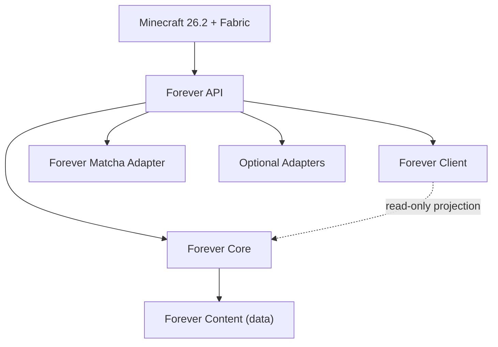
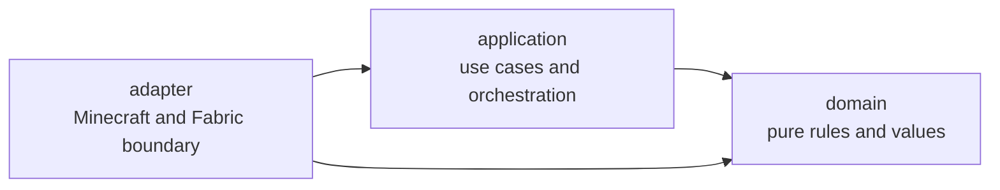

# Architecture

This document describes the intended structure of Forever. It includes implemented
boundaries and reserved future ones. It exists so that later agents place new code
in the right module instead of accumulating everything into one class or one save blob.

> Current reality: implemented feature packages exist, but only `core/storage` has
> been migrated to the layered layout in the current pilot. Other feature packages
> remain flat until their own migrations are reviewed. Do not create empty
> placeholder classes to "complete" this diagram.

## Module overview



```
Minecraft 26.2 + Fabric
|
+-- Forever API
|   +-- registries
|   +-- extension interfaces
|   +-- events
|   +-- compatibility contracts
|
+-- Forever Core
|   +-- player mastery
|   +-- equipment state
|   +-- settlements
|   +-- NPC careers
|   +-- economy
|   +-- food/alchemy
|   +-- storage/logistics
|   +-- transportation
|   +-- regional knowledge
|   +-- projects
|   +-- world chronicle
|
+-- Forever Client
|   +-- screens
|   +-- HUD and overlays
|   +-- tooltips
|   +-- Field Guide
|   +-- recipe-viewer integration
|
+-- Forever Content
|   +-- JSON definitions, tags, recipes, trades, loot
|   +-- translations, textures, models, sounds
|
+-- Forever Matcha Adapter
|   +-- version detection
|   +-- item identity translation
|   +-- behaviour mappings
|   +-- compatibility overrides
|   +-- audit metadata
|   +-- future migration helpers
|
+-- Optional Adapters
    +-- cooking mods, season/weather mods, rail mods,
        animal/horse mods, storage mods, world-generation mods
```

## Module responsibilities

### Forever API (`dev.forever.api`)
Stable extension surface: registries, extension interfaces, events, and compatibility
contracts. This is the only module other modules are encouraged to depend on broadly.
It must stay small. An interface belongs here only when it is a genuine compatibility
boundary or has a real implementation, never merely a hypothetical one.

### Forever Core (`dev.forever.core.*`)
All server-authoritative gameplay logic, one package per system. Core owns the truth.
It must not import anything from `dev.forever.client`.

### Forever Client (`dev.forever.client.*`)
Screens, HUD, overlays, tooltips, the Field Guide, and recipe-viewer integration.
The client is a **projection**: it renders synchronised summaries of server state and
never decides a gameplay outcome. Lives in the `client` source set, which is compiled
separately so accidental cross-references fail at build time rather than crashing a
dedicated server at runtime.

### Forever Content (`src/main/resources/data`, `.../assets`)
JSON balance definitions, tags, recipes, trades, loot, translations, and art. Per
principle 12, numbers live here rather than in code.

### Forever Matcha Adapter (`dev.forever.compat.matcha`)
The **only** package permitted to know Matcha's internal identifiers, scoreboard names,
function paths, or disguised item identities. It translates them into stable Forever
concepts. See `docs/adr/0002-isolate-matcha-behind-adapter.md`.

### Optional Adapters (`dev.forever.compat.*`)
One package per optional third-party integration, each behind a capability interface
with a working no-op/default fallback so the absence of the mod is never a crash.

## Layered feature packages

The outer structure remains package-by-feature. Each implemented server feature lives under
`dev.forever.core.<feature>`. Inside that feature, use `domain`, `application`, and `adapter`
only when there is real code for the layer. This makes the boundary visible without scattering
one feature across a project-wide layer tree.



### Layer responsibilities

| Layer | Owns | Allowed direction | Example in `core/storage` |
|---|---|---|---|
| `domain` | Pure rules, value objects, validation, bounded results, and Minecraft-independent data contracts | May use the JDK and neutral shared helpers. Must not import `net.minecraft`, Fabric, `application`, or `adapter`. | `StorageBalance`, `CacheOperation`, `WarehouseSearchRequest` |
| `application` | Use cases, lifecycle services, and orchestration independent of concrete Minecraft integration | May use `domain` and neutral shared helpers. Must not import `adapter`. | `StorageBalanceAccess` |
| `adapter` | Items, components, registries, `SavedData`, resource reloads, world and container access, Minecraft-shaped codecs, and server entrypoints | May use `application`, `domain`, Minecraft, and Fabric | `WarehouseController`, `TravelerCache`, `ForeverStorage` |

The dependency rule is inward only: `adapter -> application -> domain`. An adapter may depend
directly on domain as well. Same-layer collaboration is allowed when it does not create a
cycle. Domain and application code must not reach outward to a concrete adapter. A Minecraft
type that is needed by a lower layer should remain at the adapter boundary, or be translated to
a genuinely useful neutral value type as part of a separate behaviour-preserving change.

Classification is by inspected responsibility, not by filename or the presence of one import.
A registration entrypoint or a codec helper can belong in `adapter` even when it has no direct
Minecraft import because it serves Minecraft-shaped state. Conversely, a codec for a pure
domain value may remain beside that value. See [ADR 0021](adr/0021-layered-feature-packages.md)
for the complete storage pilot classification and its recorded exceptions.

### Where a new file goes

1. Choose the owning feature first. Do not create a project-wide layer package or put a feature
   rule in an unrelated utility package.
2. Put a rule, invariant, value object, validation function, or explainable result in
   `<feature>.domain` when it can be tested without Minecraft or Fabric.
3. Put a game-independent use case or orchestration service in `<feature>.application` when it
   coordinates domain operations without depending on a concrete adapter.
4. Put code that touches registries, items, components, `ItemStack`, worlds, containers,
   `SavedData`, resource reloads, events, or Minecraft-bound codecs in `<feature>.adapter`.
5. If a class crosses layers, split it only along a real seam and preserve behaviour with
   boundary tests. Do not add empty packages, speculative ports, or wrappers merely to make the
   diagram look complete.
6. Keep implementation details package-private where they do not need to cross a layer. Make
   a type public only for a real caller and document the contract it exposes.

Tests should follow the boundary they exercise. Plain JVM tests belong under `src/test/java` and
may cover domain and game-independent application code. Dedicated-server behaviour belongs under
`src/gametest/java`. The client source set remains separate and may render server projections,
but it must never decide a server-authoritative outcome.

## Data placement

Choosing the wrong storage mechanism is the most expensive mistake available here,
because it is the hardest to migrate later. The division:

| Data | Mechanism | Rationale |
|---|---|---|
| Compact player state (mastery levels, active loadout) | Persistent **player attachment/component** | Travels with the player, including between dimensions and servers |
| Compact villager state (career, rank, known techniques) | Persistent **entity attachment/component** | Dies and saves with the entity it describes |
| Compact per-`ItemStack` state (condition, path, craftsmanship) | Custom **item data components** | Must survive being dropped, traded, and stored in containers |
| Large records: settlements, warehouses, routes, shipments, world history | **World-scoped saved data** | Too large for attachments; shared between many entities; needs its own lifecycle |

**Do not put everything in one giant attachment.** A single `ForeverPlayerData` blob
containing mastery, inventory indexes, settlement membership, and chronicle entries
would be unversionable in practice and would serialise on every change.

None of this is implemented in this milestone. The division is documented now so that
the first agent to implement persistence does not have to invent it under deadline.

## Authority and networking

- The **server is authoritative**. Always.
- Client state is a synchronised projection, never the gameplay authority.
- No client-only class may be referenced by common/server code.
- Common and client use **split source sets** so violations are compile errors.
- Networking payloads must be **versioned and bounded**. A payload with an
  unbounded list is a denial-of-service vector and a future migration problem.
- Avoid synchronising an entire mutable world record when a summary or delta suffices.
  A warehouse with 40,000 items must never send 40,000 entries because a screen opened.

## Performance constraints

- **No unbounded world scans.** Registration is explicit; results are cached.
- **No permanent chunk loading** for passive settlement simulation.
- Unloaded settlements use bounded abstract simulation with a fixed per-tick budget.

## Anti-patterns

- A god-object `ForeverManager`.
- Global mutable singletons holding world state (breaks multi-world and integrated
  server restart).
- Interfaces with only hypothetical implementations.
- Premature abstraction ahead of a second real caller.
- Swallowed exceptions and broad `catch (Exception)` without context.

## Why Java and not Kotlin

Recorded in `docs/adr/0019-use-java-not-kotlin.md`. Summary: the official Fabric 26.2
template and toolchain are Java-first, Kotlin would add a required runtime dependency
(Fabric Language Kotlin) and another pinned version to track, and Java has far better
AI-agent training coverage for Fabric, which matters for an AI-maintained codebase.
